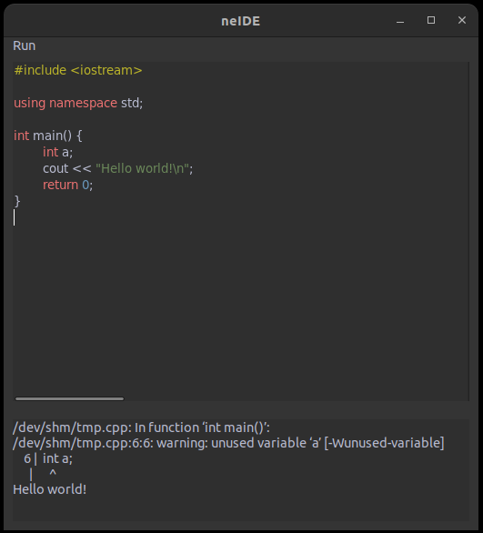

# neIDE - not IDE simple C++ code runner

Basically it is a notepad with only one button - "Run" and output area catching
stdout and stderr streams during file compilation and execution. Simple, fast and
lightweight. Can be used as C++ primitive code checker without opening 
a powerful IDE like VS or sending your code to online services like godbolt.org.
Currently only black theme is available but also a code syntax highlight is enabled.

## Usage

- Run application
- A default C++ template will be loaded
- Click on "Run" text in the upper left corner

By default, temporary files are located at `/dev/shm/` folder. If it doesn't
exist then they are created in the app directory. 

## Installation

- Download the repo
- Install wxWidgets libs: `libwxbase3.0-dev` and `libwxgtk3.0-gtk3-dev`
- Go to the repo dir
- Create build dir, go inside
- Run `cmake ..` and then `make`
- Run created binary file - `neide`

